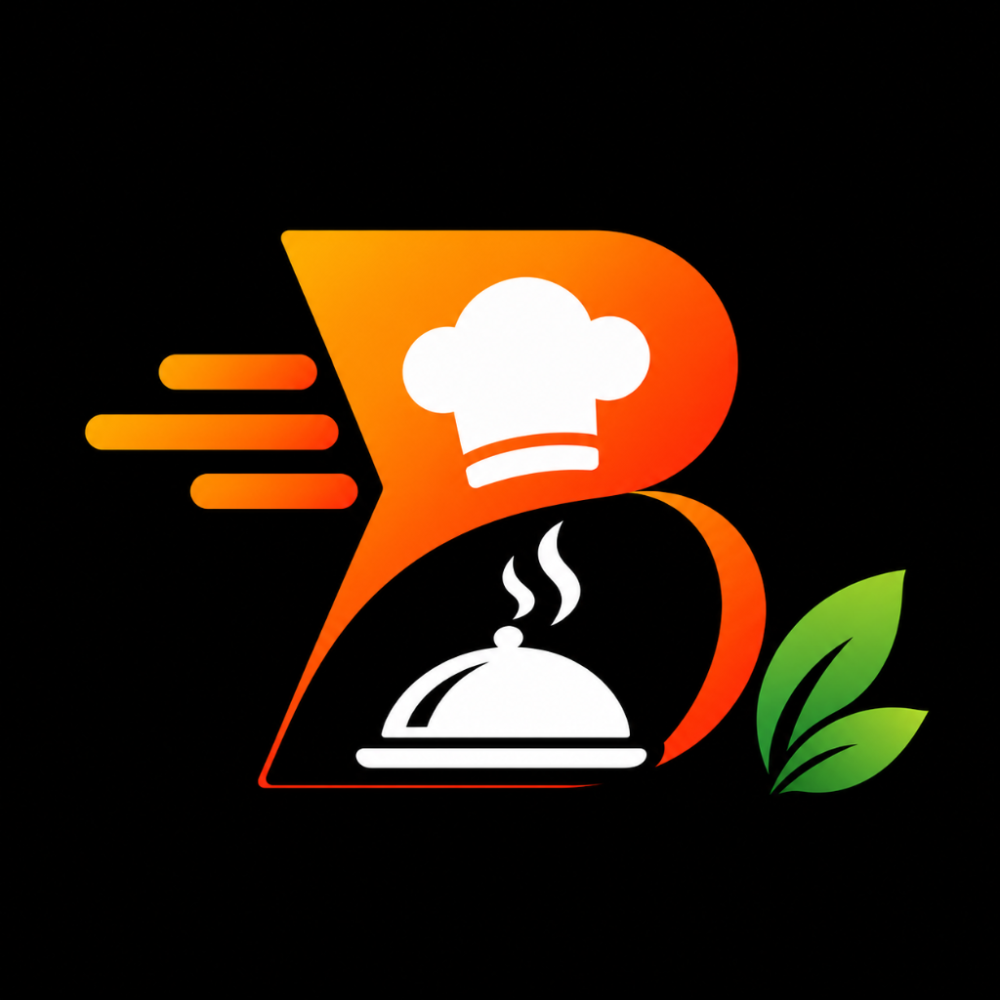
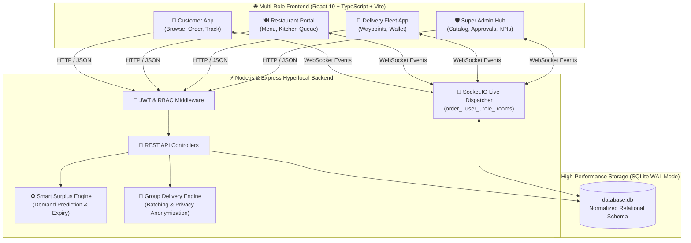
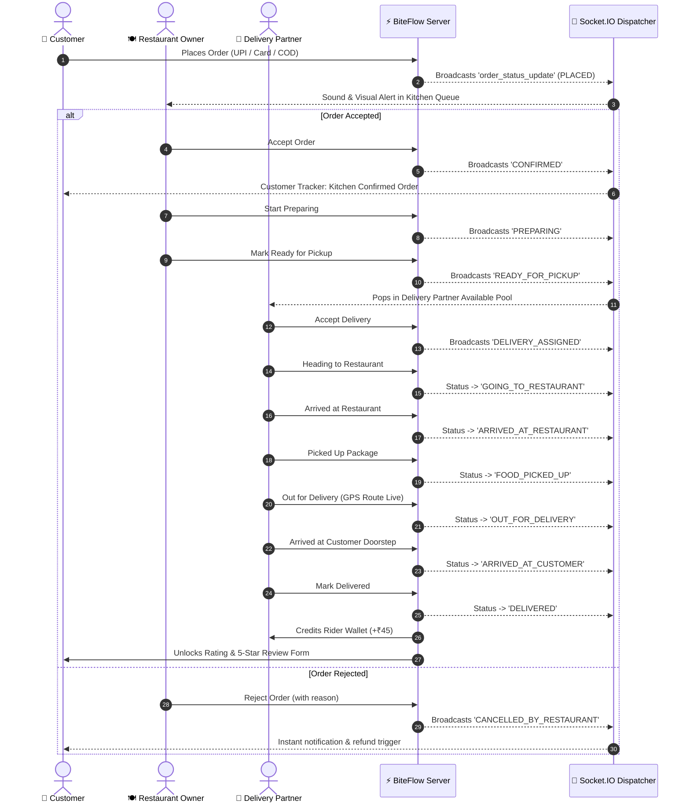
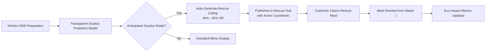
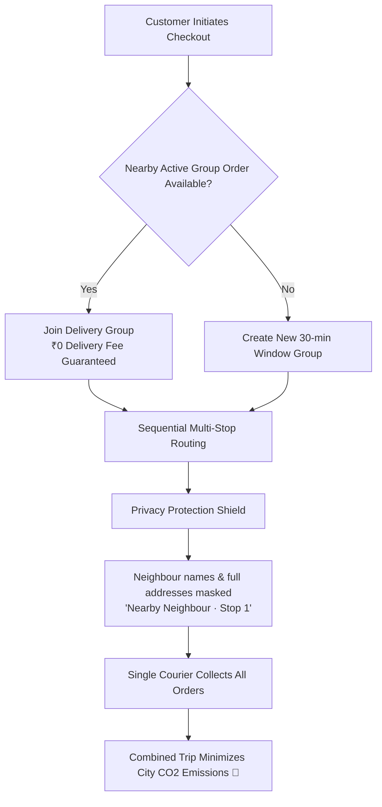
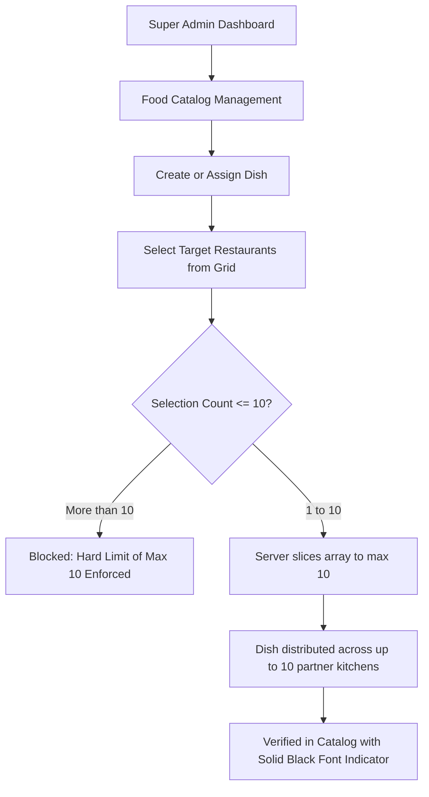

<div align="center">



# BiteFlow — Modern Hyperlocal Food Delivery Platform
### Enterprise Multi-Role Food Delivery Ecosystem with Live Socket.IO Tracking, Smart Surplus Rescue, and SQLite WAL

[](#)
[](#)
[](#)
[](#)
[](#)
[](#)
[](#)

<p align="center">
  A production-grade hyperlocal food delivery platform inspired by <b>Swiggy</b> and <b>Zomato</b>, featuring <b>4 strictly enforced RBAC roles</b>, real-time bidirectional order dispatching, live GPS waypoint delivery tracking, Indian UPI payment stack, and <b>groundbreaking green innovations</b> for surplus food rescue and group delivery.
</p>

[System Flowcharts](#-system-architecture--flowcharts) • [Implemented Innovations](#-implemented-innovations) • [Tech Stack](#-technology-stack) • [Quick Start](#-quick-start)

---

</div>

## 📊 System Architecture & Flowcharts

### 1. High-Level Ecosystem Architecture


---

### 2. Complete Order Lifecycle & Real-Time State Machine


---

### 3. Smart Surplus Rescue Architecture


---

### 4. Neighbourhood Group Delivery & Privacy Route Batching


---

### 5. Multi-Restaurant Food Assignment Flow (Max 10 Restaurants)


---

## 💡 Implemented Innovations

- ♻️ **Smart Surplus Rescue**: Dynamic discounted meals (**up to 50% off**) from restaurants approaching shift close to prevent kitchen food waste.
- 🚚 **Neighbourhood Group Delivery**: Batches nearby neighbour orders in 30-minute windows for **₹0 delivery fee** with sequential delivery stops and strict customer privacy anonymization.
- 🌱 **Your Delivery Impact**: Live environmental dashboard calculating rescued meals, combined courier trips, and diverted food waste metrics.
- ⚙️ **Restaurant Surplus & Operations Hub**: Kitchen staff demand forecast table, 1-click rescue listing creator, and group route dispatching controls.

---

## 🛠️ Technology Stack

- **Frontend**: React 19, TypeScript, Vite 8, Swiggy/Zomato-inspired Vanilla CSS Design System
- **Backend**: Node.js, Express.js, Socket.IO v4 (Live Order Dispatching & Room Events)
- **Database**: SQLite 3 with WAL Mode (Sub-millisecond queries, Normalized Relational Schema)
- **Security**: JWT Authentication, Role-Based Access Control (RBAC), and Restaurant Ownership Barriers

---

## 💻 Quick Start

### 1. Clone & Install
```bash
git clone https://github.com/SanthoshkumarS2407/BiteFlow-Food-Delivery.git
cd BiteFlow-Food-Delivery

# Install dependencies
npm install
```

### 2. Run Application
```bash
# Run Full Stack (Express API on :5000 + Vite Frontend on :3000)
npm run dev
```

### 3. Open in Browser
- **Frontend App**: [http://localhost:3000](http://localhost:3000)
- **Backend API Server**: [http://localhost:5000](http://localhost:5000)

---

## 📂 Project Directory Structure

```
BiteFlow-Food-Delivery/
├── .env                       # Local environment variables
├── .env.example               # Template environment configuration
├── .gitignore                 # Excluded directories, temporary files & SQLite journals
├── database.db                # SQLite database with 15+ restaurants, 300+ dishes, and demo groups
├── index.html                 # Main entry point with title: 'BiteFlow — Food Delivery'
├── package.json               # Project manifest, dependencies, and NPM scripts
├── package-lock.json          # Dependency lockfile
├── seed_indian_data.js        # Comprehensive multi-restaurant and menu seeder
├── server.js                  # Express backend with Socket.IO, RBAC, and SQLite WAL engine
├── server_features.js         # Surplus rescue engine, group route batching, and analytics
├── test_e2e_lifecycle.js      # E2E lifecycle and role security test suite
├── tsconfig.json              # TypeScript root configuration
├── tsconfig.node.json         # Node-specific TypeScript config
├── vite.config.ts             # Vite bundler configuration with backend proxy
├── public/                    # Static public assets (logo, favicon)
└── src/                       # Frontend source application
    ├── App.tsx                # Page router and modal coordinator
    ├── index.css              # Design system tokens, utilities, and components
    ├── main.tsx               # React 19 entry point
    ├── types.ts               # TypeScript interfaces and type contracts
    ├── components/            # Reusable UI components (Navbar, Modals, Cards, Tabs)
    ├── contexts/              # Global state management (AppContext, ToastContext)
    ├── data/                  # Static fallback catalog data
    └── pages/                 # Full-screen page views (Home, Admin, RescueHub, etc.)
```

---

## 📄 License
This project is open-source under the **MIT License**.

© 2026 **BiteFlow Technologies**. All rights reserved.
