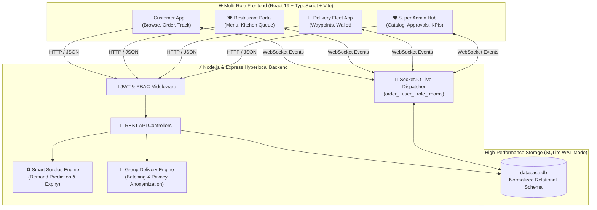
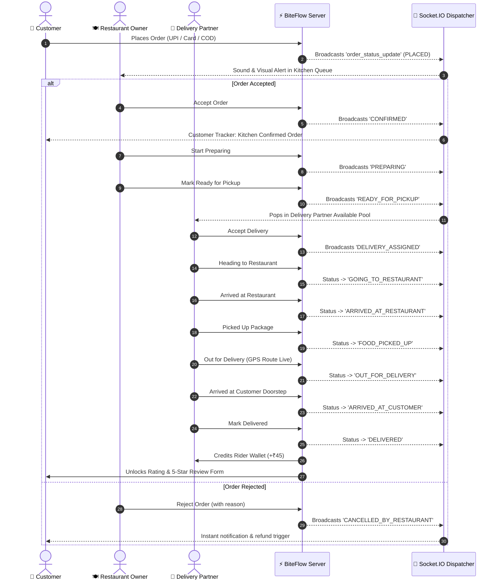
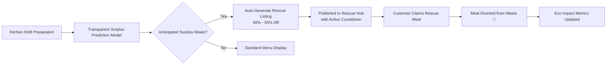
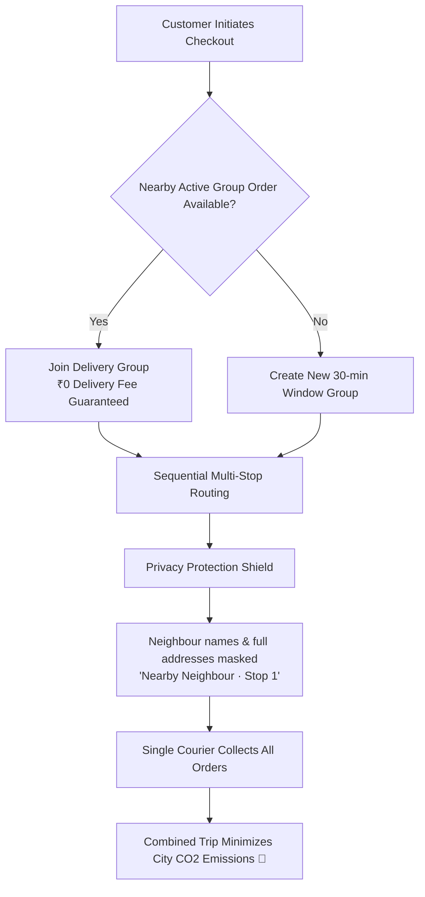
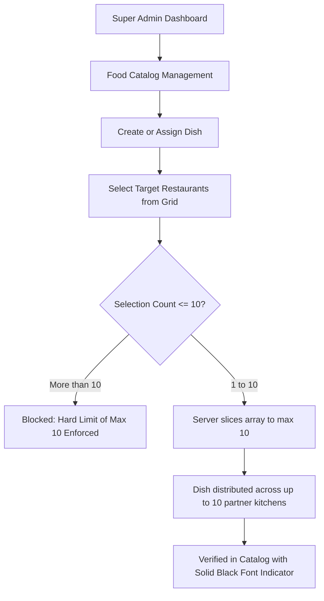

<div align="center">


# BiteFlow — Modern Hyperlocal Food Delivery Platform
### Enterprise Multi-Role Food Delivery Ecosystem with Live Socket.IO Tracking, Smart Surplus Rescue, and SQLite WAL

[](#)
[](#)
[](#)
[](#)
[](#)
[](#)
[](#)

<p align="center">
  A production-grade hyperlocal food delivery platform inspired by <b>Swiggy</b> and <b>Zomato</b>, featuring <b>4 strictly enforced RBAC roles</b>, real-time bidirectional order dispatching, live GPS waypoint delivery tracking, Indian UPI payment stack, and <b>groundbreaking green innovations</b> for surplus food rescue and group delivery.
</p>

[Quick Start](#-quick-start) • [Interactive Flowcharts](#-system-architecture--flowcharts) • [The 4 User Roles](#-the-4-user-roles--demo-credentials) • [Implemented Innovations](#-implemented-innovations-deep-dive) • [API Reference](#-api-endpoints-reference)

---

</div>

## 📊 System Architecture & Flowcharts

### 1. High-Level Ecosystem Architecture


---

### 2. Complete Order Lifecycle & Real-Time State Machine


---

### 3. Smart Surplus Rescue Architecture


---

### 4. Neighbourhood Group Delivery & Privacy Route Batching


---

### 5. Multi-Restaurant Food Assignment Flow (Max 10 Restaurants)


---

## 🔐 The 4 User Roles & Demo Credentials

BiteFlow provides pre-configured verified credentials for every role, plus **1-Click Quick Login** buttons on the login portal:

| Role | Email | Password | Primary Portal | Key Capabilities |
| :--- | :--- | :--- | :--- | :--- |
| **🛡️ Super Admin** | `admin@biteflow.com` | `admin123` | `/admin` | Platform KPIs, restaurant approvals, user suspensions, multi-restaurant food assignment (max 10), surplus analytics |
| **🍽️ Restaurant Owner** | `owner@biteflow.com` | `owner123` | `/owner-dashboard` | Own restaurant menu, nutritional facts editor, kitchen open/close toggle, real-time incoming order queue |
| **🛵 Delivery Partner** | `delivery@biteflow.com` | `delivery123` | `/delivery-dashboard` | Online/Offline toggle, available orders pool, trip GPS waypoint progression, wallet earnings (₹45/trip) |
| **👤 Customer** | `user@biteflow.com` | `user123` | `/` | Swiggy/Zomato style food browsing, 10+ restaurant categories, surplus rescue, ₹0 group delivery, live map tracking |
| **🛡️ Admin (Backup)** | `admin@savorit.com` | `admin123` | `/admin` | Secondary administrative account |

---

## 🚀 Implemented Innovations Deep Dive

BiteFlow integrates 4 industry-first environmental and operational innovations directly into the platform navigation under **Implemented Innovations**:

### ♻️ 1. Smart Surplus Rescue
- **Problem**: Commercial restaurant kitchens prepare fresh dishes every shift and discard unpurchased meals at service close.
- **Solution**: Dynamic discounted rescue listings (**up to 50% off**) with rolling expiry timers.
- **Verified Coverage**: Customers can claim authentic surplus dishes directly into their cart while preventing kitchen waste.

### 🚚 2. Neighbourhood Group Delivery
- **Problem**: Multiple customers in the same apartment block or street pay separate delivery fees and cause multiple solitary motorbike trips.
- **Solution**: Batches nearby orders within a 30-minute window, granting **₹0 delivery fees** to all participants.
- **Privacy Protection**: Anonymizes other customers' full names, phone numbers, and exact addresses (*"Nearby Neighbour · Stop 1"*).

### 🌱 3. Your Delivery Impact Dashboard
- **Features**: Visual eco-impact metrics calculating:
  1. *Rescue Meals Supported*
  2. *Group Deliveries Joined*
  3. *Solitary Delivery Trips Combined*
  4. *Estimated Food Waste Diverted (kg)*
- **Accessibility**: Includes a community guest mode so visitors can view platform-wide environmental milestones before signing in.

### ⚙️ 4. Restaurant Surplus & Operations Hub
- **Features**: Dedicated staff forecasting table with 40+ forecasted dish items, recommended rescue pricing, 1-click publishing modal, and group delivery dispatch route controls.
- **Convenience**: Includes a 1-click Super Admin login button directly on the access gate for rapid evaluation.

---

## 🍽️ Culinary Categories & Restaurant Coverage

Every category on BiteFlow is backed by **at least 10 verified restaurants** with dishes:

| Category | Restaurant Count | Signature Cuisines & Offerings |
| :--- | :---: | :--- |
| **🍨 Desserts** | **15 Restaurants** | Kulfi, Gulab Jamun, Belgian Waffles, Cheesecakes, Pastries |
| **🥤 Beverages** | **15 Restaurants** | Filter Coffee, Mango Lassi, Fresh Juices, Milkshakes |
| **🥢 Chinese** | **12 Restaurants** | Hakka Noodles, Schezwan Fried Rice, Dim Sums, Spring Rolls |
| **🍛 North Indian** | **12 Restaurants** | Butter Chicken, Paneer Tikka Masala, Dal Makhani, Garlic Naan |
| **🍚 Biryani** | **11 Restaurants** | Hyderabadi Dum Biryani, Chettinad Biryani, Ambur Mutton Biryani |
| **🍕 Pizza** | **11 Restaurants** | Neapolitan Pizza, Farmhouse Supreme, Cheese Burst, Peri-Peri |
| **🍔 Burgers** | **11 Restaurants** | Crispy Chicken Burgers, Veggie Crunch, Gourmet Smash Burgers |
| **🥞 South Indian** | **11 Restaurants** | Ghee Roast Dosa, Idli Sambar, Medu Vada, Pongal |

---

## 🛠️ Technology Stack

| Layer | Technology | Key Details |
| :--- | :--- | :--- |
| **Frontend** | React 19, TypeScript, Vite 8 | Fast HMR, component modularity, zero bundle warnings |
| **Styling** | Vanilla CSS Design System | Curated CSS custom properties, Swiggy/Zomato design language, responsive grids |
| **Backend** | Node.js, Express.js | REST APIs, modular controllers, JWT authentication |
| **Real-Time** | Socket.IO v4 | WebSocket rooms for live order dispatching with polling fallback |
| **Database** | SQLite 3 with WAL Mode | Sub-millisecond queries, normalized relational schema, full transactional integrity |
| **Security** | bcryptjs, jsonwebtoken, CORS | Role-based middleware, parameter sanitization, ownership barriers |

---

## 💻 Quick Start & Local Setup

### Prerequisites
- **Node.js**: v18.0.0 or higher
- **npm**: v9.0.0 or higher

### 1. Clone & Install
```bash
git clone https://github.com/SanthoshkumarS2407/BiteFlow-Food-Delivery.git
cd BiteFlow-Food-Delivery

# Install dependencies
npm install
```

### 2. Run Application
```bash
# Option A: Run Full Stack Concurrently (Server on :5000 + Frontend on :3000)
npm run dev

# Option B: Run Server and Client individually
npm run dev:server   # Starts Express backend on http://localhost:5000
npm run dev:client   # Starts Vite frontend on http://localhost:3000
```

### 3. Open in Browser
- **Application Frontend**: [http://localhost:3000](http://localhost:3000)
- **Backend API Server**: [http://localhost:5000](http://localhost:5000)

### 4. Build for Production
```bash
npm run build
```

---

## 📡 API Endpoints Reference

### 🔐 Authentication (`/api/auth`)
- `POST /api/auth/register` — Register a new account (`CUSTOMER`, `RESTAURANT_OWNER`, `DELIVERY_PARTNER`).
- `POST /api/auth/login` — Authenticate with email/password and obtain JWT.
- `GET /api/auth/me` — Retrieve active authenticated user profile.
- `PUT /api/auth/profile` — Update user profile details.

### 👤 Customer Endpoints
- `GET /api/restaurants` — Search and filter approved restaurants with category matching.
- `GET /api/restaurants/:id` — Restaurant profile, menu catalog, and customer reviews.
- `POST /api/orders` — Create order with items, delivery address, and demo payment.
- `GET /api/orders` — List user's active and past orders.
- `GET /api/orders/:id` — Real-time tracking data with live driver coordinates and status history.
- `POST /api/orders/:id/reorder` — Instant reorder of previous meal items.
- `POST /api/reviews` — Submit ratings and review text for completed orders.
- `GET /api/addresses` & `POST /api/addresses` — Manage saved customer delivery addresses.

### ♻️ Smart Surplus Rescue & Innovations
- `GET /api/rescue` — Discover active surplus meals with 40%–50% discount and remaining portions.
- `GET /api/rescue/prediction/:restaurantId` — Staff demand prediction model and surplus estimates.
- `GET /api/delivery-groups/available` — Nearby open group delivery windows for ₹0 delivery fee.
- `GET /api/delivery-groups/:id` — Group tracking screen with sequential stops and privacy preservation.
- `GET /api/impact` — Environmental impact metrics (diverted meals, combined trips, CO2 savings).

### 🍽️ Restaurant Owner (`requireOwner`)
- `GET /api/owner/restaurant` — Retrieve owned restaurant profile.
- `PUT /api/owner/restaurant/:id/toggle-open` — Toggle kitchen open/closed status.
- `GET /api/owner/foods/:restaurantId` — Fetch restaurant menu catalog.
- `POST /api/owner/foods` — Create food item with complete nutritional facts.
- `GET /api/owner/orders/:restaurantId` — Real-time kitchen order queue.
- `PUT /api/owner/orders/:id/accept` — Accept incoming order.
- `PUT /api/owner/orders/:id/prepare` — Advance status to kitchen preparing.
- `PUT /api/owner/orders/:id/ready` — Mark order ready for courier pickup.

### 🛵 Delivery Fleet (`requireDelivery`)
- `GET /api/delivery/profile` — Driver details, vehicle, rating, and wallet earnings.
- `PUT /api/delivery/availability` — Toggle Online/Offline courier status.
- `GET /api/delivery/available-orders` — View pickup-ready orders.
- `POST /api/delivery/accept/:orderId` — Assign order to courier.
- `PUT /api/delivery/orders/:orderId/status` — Step through delivery route waypoints (`GOING_TO_RESTAURANT` → `ARRIVED` → `PICKED_UP` → `OUT_FOR_DELIVERY` → `ARRIVED_AT_CUSTOMER` → `DELIVERED`).

### 🛡️ Super Admin (`requireAdmin`)
- `GET /api/admin/stats` — Real-time platform KPI metrics (users, orders, revenue, fleet).
- `GET /api/admin/restaurants` — List all restaurants with approval controls.
- `PUT /api/admin/restaurants/:id/status` — Approve, Reject, or Suspend restaurant.
- `POST /api/admin/foods` — Add food item across multiple restaurants (**capped at max 10**).
- `POST /api/admin/foods/:id/assign-restaurants` — Assign dish to restaurants (**capped at max 10**).
- `PUT /api/admin/users/:id/status` — Activate or suspend user accounts.
- `GET /api/admin/delivery-partners` — Delivery partner fleet management.
- `GET /api/admin/analytics/rescue` — Surplus rescue platform analytics.

---

## 📂 Project Directory Structure

```
BiteFlow-Food-Delivery/
├── .env                       # Local environment variables
├── .env.example               # Template environment configuration
├── .gitignore                 # Excluded directories, temporary files & SQLite journals
├── database.db                # SQLite database with 15+ restaurants, 300+ dishes, and demo groups
├── index.html                 # Main entry point with title: 'BiteFlow — Food Delivery'
├── package.json               # Project manifest, dependencies, and NPM scripts
├── package-lock.json          # Dependency lockfile
├── seed_indian_data.js        # Comprehensive multi-restaurant and menu seeder
├── server.js                  # Express backend with Socket.IO, RBAC, and SQLite WAL engine
├── server_features.js         # Surplus rescue engine, group route batching, and analytics
├── test_e2e_lifecycle.js      # E2E lifecycle and role security test suite
├── tsconfig.json              # TypeScript root configuration
├── tsconfig.node.json         # Node-specific TypeScript config
├── vite.config.ts             # Vite bundler configuration with backend proxy
├── public/                    # Static public assets
│   ├── favicon.png            # BiteFlow browser icon
│   └── logo.png               # High-resolution brand logo
└── src/                       # Frontend source application
    ├── App.tsx                # Page router and modal coordinator
    ├── index.css              # Design system tokens, utilities, and components
    ├── main.tsx               # React 19 entry point
    ├── types.ts               # TypeScript interfaces and type contracts
    ├── components/            # Reusable UI components
    │   ├── AdminGroupDeliveryTab.tsx # Group delivery route controls & analytics
    │   ├── AdminRescueTab.tsx        # Staff forecast table & surplus listing creator
    │   ├── DeliveryTrackingMap.tsx   # Live GPS route map
    │   ├── DemoScenariosBar.tsx      # Quick role-switching bar
    │   ├── DirectOrderModal.tsx      # Instant 1-click ordering modal
    │   ├── FoodCard.tsx              # Interactive food card with veg/non-veg tags
    │   ├── FoodDetailModal.tsx       # Nutritional breakdown & customizer modal
    │   ├── LocationModal.tsx         # Address and GPS picker
    │   ├── MobileBottomNav.tsx       # Responsive mobile navigation
    │   ├── Navbar.tsx                # Main header with role badge, search, and innovations menu
    │   ├── RescueFoodSection.tsx     # Homepage surplus rescue carousel
    │   ├── RestaurantCard.tsx        # Restaurant card with discount badges & ETA
    │   └── SmartComboSection.tsx     # AI-curated smart combo suggestions
    ├── contexts/              # Global state management
    │   ├── AppContext.tsx            # Auth, cart, location, and navigation provider
    │   └── ToastContext.tsx          # Toast notification system
    ├── data/                  # Static fallback data
    │   └── fallbackRestaurants.ts    # Fallback catalog with 10+ restaurants per category
    └── pages/                 # Full-screen page views
        ├── Admin.tsx                 # Super Admin platform dashboard
        ├── Auth.tsx                  # Sign In / Register with 1-click demo logins
        ├── CartPage.tsx              # Cart review, delivery progress bar & bill breakdown
        ├── Checkout.tsx              # Indian payment gateway (UPI, Card, COD)
        ├── DeliveryPartnerDashboard.tsx # Courier delivery portal
        ├── Favorites.tsx             # Saved favourite dishes & restaurants
        ├── GroupDeliveryTracking.tsx # Real-time group delivery tracking with stops
        ├── Home.tsx                  # Homepage with "What's on your mind?" category slider
        ├── Offers.tsx                # Deals, coupons, and discounts hub
        ├── OrderHistory.tsx          # Order receipt history and invoice review
        ├── OrderTracking.tsx         # Live Socket.IO customer order tracker
        ├── Profile.tsx               # Account settings and Delivery Impact Dashboard
        ├── RescueHub.tsx             # Smart Surplus Food Rescue Hub
        ├── RestaurantDetail.tsx      # Restaurant menu categories & nutritional facts
        ├── RestaurantOwnerDashboard.tsx # Restaurant owner portal
        ├── Restaurants.tsx           # Filterable restaurant catalog
        └── SearchPage.tsx            # Live search across dishes and restaurants
```

---

## 📄 License
This project is open-source under the **MIT License**.

© 2026 **BiteFlow Technologies**. All rights reserved.
